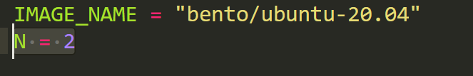
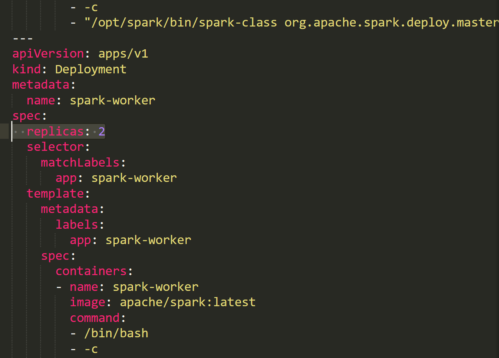
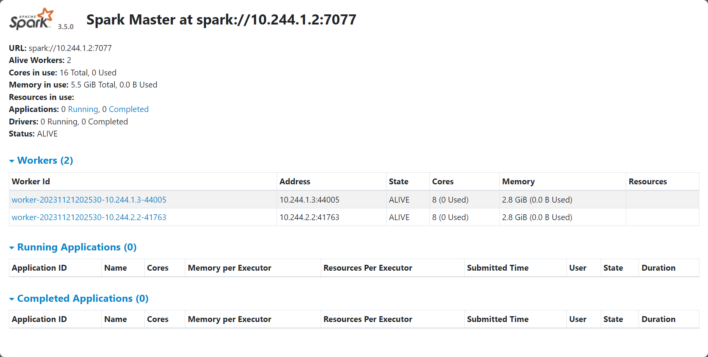

# Spark кластер на Kubernetes

## Deployment
1) Для изменения количества VM измените переменную N в Vagrantfile.

2) Для изменения количества подов на кластере исправьте replicas в spark-deployment.yaml.

3) Выполните команду: 
```bash
vagrant up && ansible-playbook -i inventory playbook.yml
```
4) Для проверки подключитесь к мастер ноде по ssh:
```bash
vagrant ssh k8s-master
```
И выполните следующие команды:
```bash
kubectl get namespace|grep spark
#spark                Active   23s
```

```bash
kubectl get service -n spark
# NAME                   TYPE        CLUSTER-IP    EXTERNAL-IP   PORT(S)    AGE
# spark-master-service   ClusterIP   10.96.88.63   <none>        7077/TCP   66s
```

```bash
kubectl get deployment -n spark
# NAME           READY   UP-TO-DATE   AVAILABLE   AGE
# spark-master   1/1     1            1           113s
# spark-worker   2/2     2            2           113s
```

```bash
kubectl get pod -n spark
# NAME                            READY   STATUS    RESTARTS   AGE
# spark-master-659d596f87-bkxnc   1/1     Running   0          3m
# spark-worker-5994548665-wr6bs   1/1     Running   0          3m
# spark-worker-5994548665-xf6b2   1/1     Running   0          3m
```
5) Проброс портов для проверки мастер ноды:

```bash
kubectl port-forward deployment/spark-master -n spark 8888:7077 
```

6) Для работы с хост машины надо пробросить порт для подключения к spark-master
```bash
kubectl port-forward deployment/spark-master -n spark 7077:7077 
```
7) Тестовый код лежит в pyspark_scripts(__пока не лежит__).
## Jenkins про триггер, credential и телеграмм бота
## Monitoring
