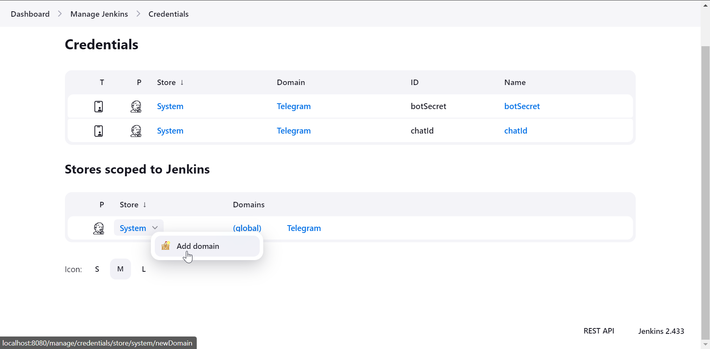
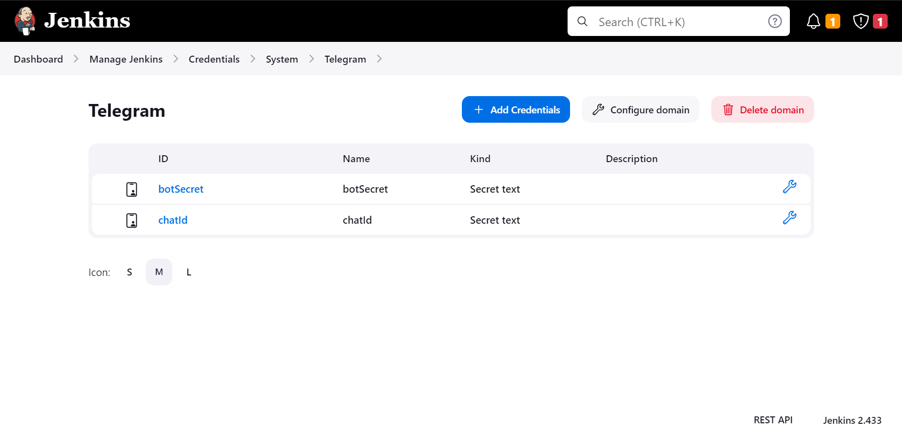
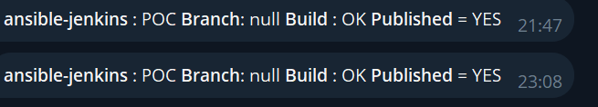
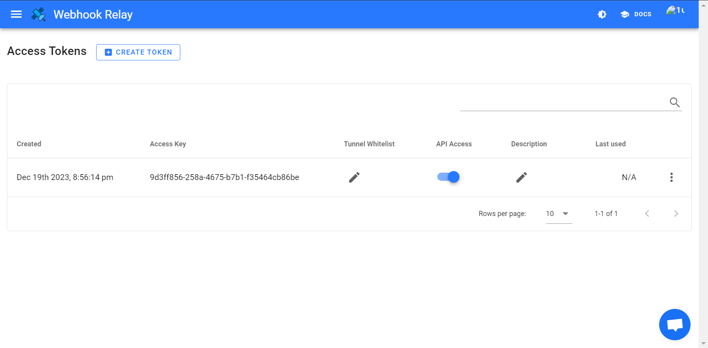
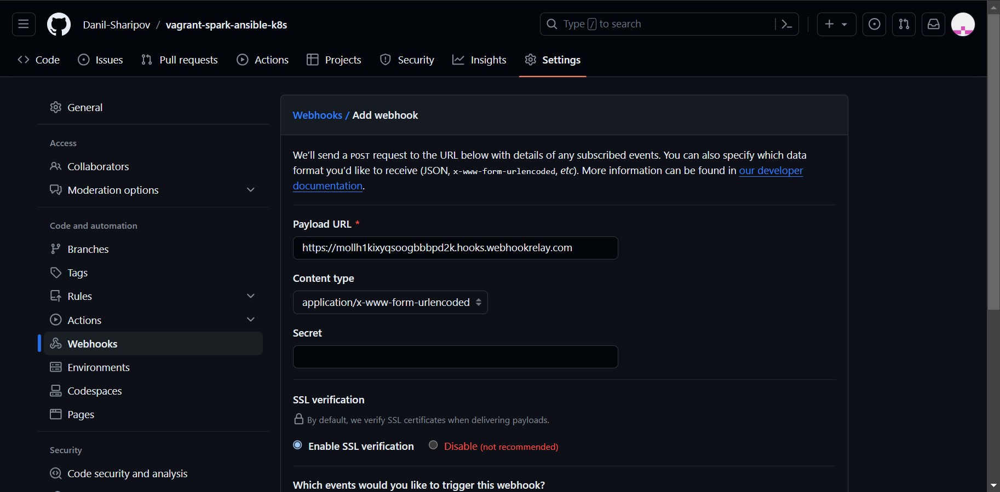
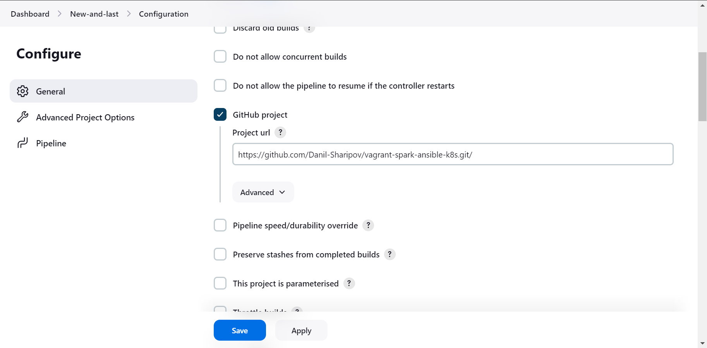
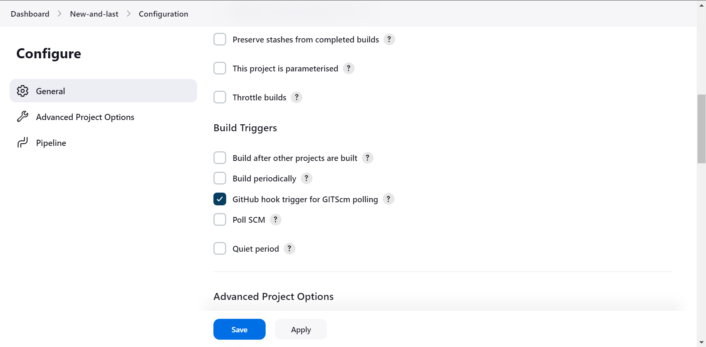
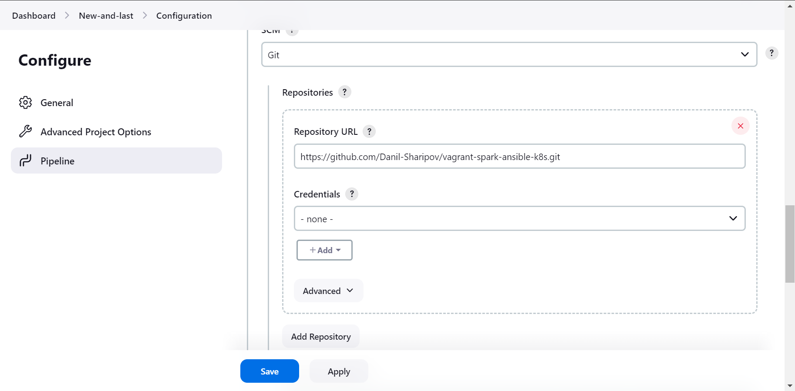

# Spark кластер на Kubernetes

## Deployment
1) Для изменения количества VM измените переменную N в Vagrantfile.

2) Для изменения количества подов на кластере исправьте replicas в spark-deployment.yaml.

3) Выполните команду: 
```bash
vagrant up && ansible-playbook -i inventory playbook.yml
```
4) Для проверки подключитесь к мастер ноде по ssh:
```bash
vagrant ssh k8s-master
```
И выполните следующие команды:
```bash
kubectl get namespace|grep spark
#spark                Active   23s
```

```bash
kubectl get service -n spark
# NAME                   TYPE        CLUSTER-IP    EXTERNAL-IP   PORT(S)    AGE
# spark-master-service   ClusterIP   10.96.88.63   <none>        7077/TCP   66s
```

```bash
kubectl get deployment -n spark
# NAME           READY   UP-TO-DATE   AVAILABLE   AGE
# spark-master   1/1     1            1           113s
# spark-worker   2/2     2            2           113s
```

```bash
kubectl get pod -n spark
# NAME                            READY   STATUS    RESTARTS   AGE
# spark-master-659d596f87-bkxnc   1/1     Running   0          3m
# spark-worker-5994548665-wr6bs   1/1     Running   0          3m
# spark-worker-5994548665-xf6b2   1/1     Running   0          3m
```
5) Проброс портов для проверки мастер ноды:

```bash
kubectl port-forward deployment/spark-master -n spark 8888:7077 
```

6) Для работы с хост машины надо пробросить порт для подключения к spark-master
```bash
kubectl port-forward deployment/spark-master -n spark 7077:7077 
```
7) Тестовый код лежит в pyspark_scripts:

Python-скрипт, который извлекает содержимое страницы Википедии с помощью библиотеки requests, анализирует HTML-контент с помощью BeautifulSoup, извлекает заголовки разделов и, наконец, преобразует извлеченные данные в DataFrame PySpark.

## Jenkins про триггер, credential и телеграмм бота
#### Создание телеграмм-бота
Чтобы создать бота для уведомлений, необходимо выполнить следующие действия:
1. Найти в Telegram бота @botfather.
2. Следуя инструкциям бота, создать нового бота.
3. Сохранить токен бота.
4. Создаем новый канал и добавляем в него бота с правами администратора
5. Получаем id чата.
Токен и id чата понадобятся на следующем этапе.
#### Добавляем credentials.
1. Manage Jenkins >> Credentials
2. Создаем новый domain:

3. Добавляем переменные для ID чата и токена бота:

4. В случае успешной настройки при успешной работе пайплайна должны приходить сообщения:

#### Настройка Jenkins для автоматического запуска pipeline
1. Регистрируемся и получаем токен на https://my.webhookrelay.com/tokens

2. Установка WebhookRelay:
```bash
curl https://my.webhookrelay.com/webhookrelay/downloads/install-cli.sh | bash
```
3. Логируемся с помощью CLI клиента:
```bash
relay login -k your-token-key -s your-token-secret	
```
4. Включаем переадресацию
```bash
relay forward --bucket github-jenkins http://localhost:8080/github-webhook/
# Forwarding:
# https://mollh1kixyqsoogbbbpd2k.hooks.webhookrelay.com -> http://localhost:8080/github-webhook/
# Starting webhook relay agent...
# 2023-12-19 21:04:17.664 INFO    using standard transport...
# 2023-12-19 21:04:17.843 INFO    webhook relay ready...  {"host": "my.webhookrelay.com:8080", "buckets": ["816b966c-c659-4964-aa2a-1eb9fbdb5780"]}
```
5. Включаем WebHook GitHub:

6. Настраиваем Pipeline:




## Monitoring
```bash

#TASK [Show Token] **************************************************************************************************************************
#ok: [vm1] => {
#    "msg": [
#        "eyJhbGciOiJSUzI1NiIsImtpZCI6IjExcm9ScGpTSVlRbkt2WUwzOWltUHBBYTNrbWVPYTZ3SVlUZ1oxRFhKdEkifQ.eyJpc3MiOiJrdWJlcm5ldGVzL3NlcnZpY2VhY2Nv
#dW50Iiwia3ViZXJuZXRlcy5pby9zZXJ2aWNlYWNjb3VudC9uYW1lc3BhY2UiOiJtb25pdG9yaW5nIiwia3ViZXJuZXRlcy5pby9zZXJ2aWNlYWNjb3VudC9zZWNyZXQubmFtZSI6Inph
#YmJpeC1zZXJ2aWNlLWFjY291bnQiLCJrdWJlcm5ldGVzLmlvL3NlcnZpY2VhY2NvdW50L3NlcnZpY2UtYWNjb3VudC5uYW1lIjoiemFiYml4LXNlcnZpY2UtYWNjb3VudCIsImt1YmVy
#bmV0ZXMuaW8vc2VydmljZWFjY291bnQvc2VydmljZS1hY2NvdW50LnVpZCI6ImE3OThjNWExLTg2Y2EtNDJlNC05YmQ3LTU5MDgyM2FiYzgyYSIsInN1YiI6InN5c3RlbTpzZXJ2aWNl
#YWNjb3VudDptb25pdG9yaW5nOnphYmJpeC1zZXJ2aWNlLWFjY291bnQifQ.lp7ERuC7s_jYtyr3CmnPRfN_gTHJd3PyUC_GT4HOKbLdVIuPgIAl-juupIcvnI4iL2bZMbsMGRbLwrldv
#QSuj2cJZGwL1tRelOMTMQgbDdVsOB1TeopPVktQn9j7AvAH1mv9mZydZ5FnkNdeg4AQ_eTPAz6A7H2129j6mveqjpmJR3ymrhDrewq46A0u6UQ7sZusOnQ5hyD3eOUAFTv1iXHGci8-h
#jYVbiH-dxf12P8JTSFF6MGnNyN5xHnIx6uV2UnA04PcABhGLSKm7L14RsizfGjEzPCsjREkfPIU_AdNrjfz8AKTyStcI2J2sh8nhcoMnM6yaDrYVAiuXpKxiQ"
#    ]
#}

```
## Destroy
```bash
vagrant destroy -f 
```
